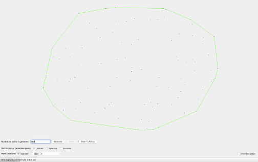

# Convex Hull Solver

A divide and conquer algorithm to find the convex hull (outer shell) of a random plot of points.
The entire algorithm runs at an optimal O(n log n) time complexity and O(n) space complexity.

Note: The algorithm is initiated through the GUI, so run the GUI.py file to interact with the program.

